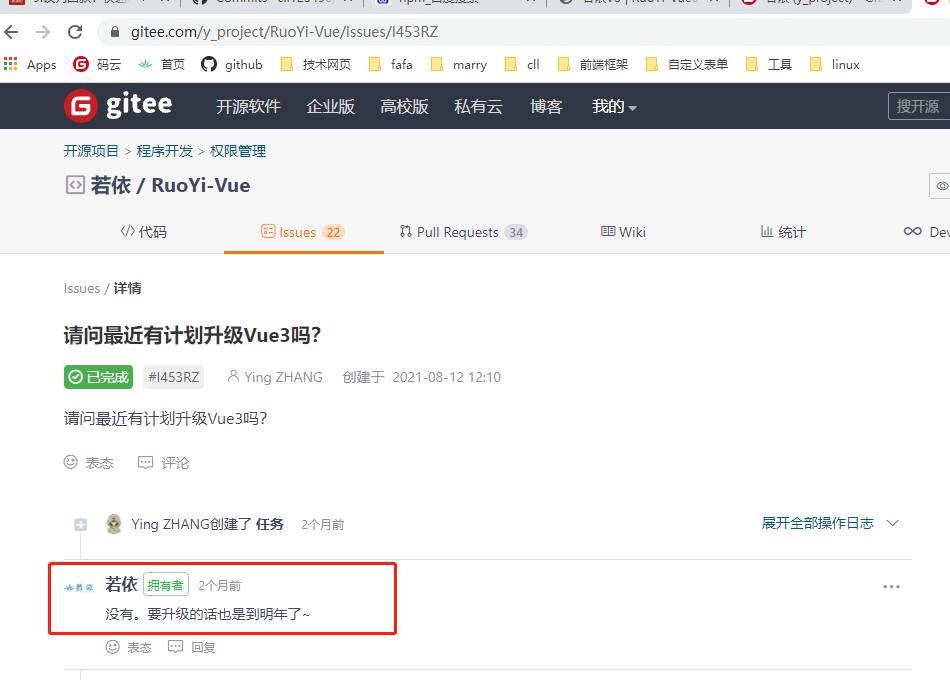
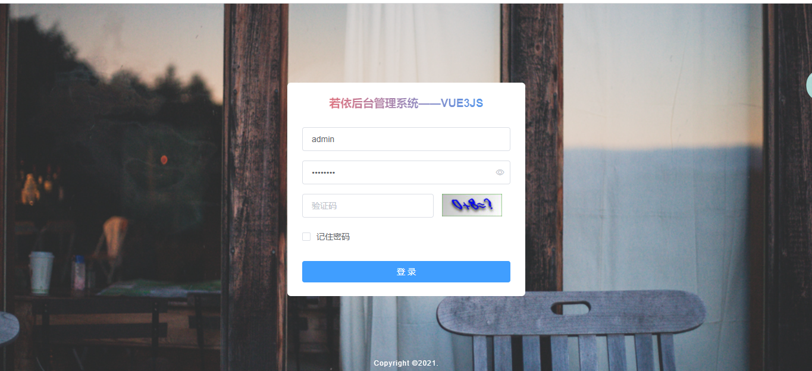
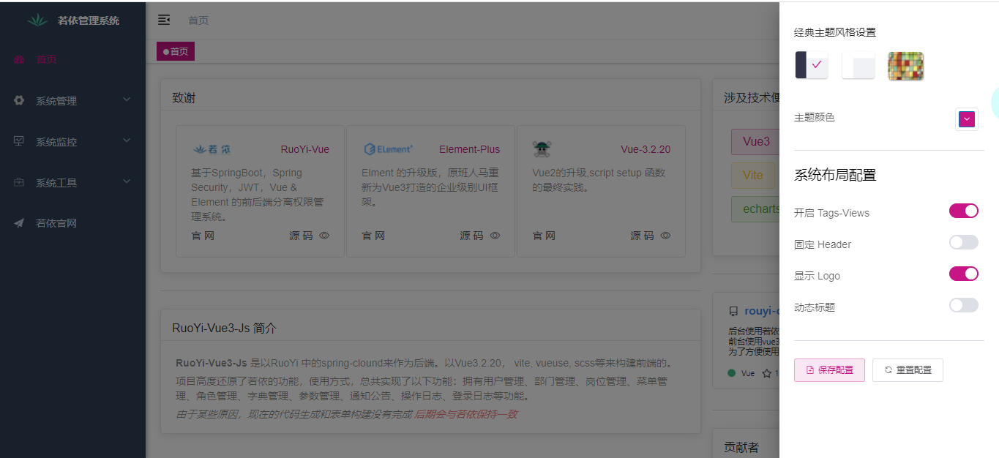

# 若依V3

::: warning WARNING
首先明确一个问题，这里不是官方的。我个人并不是若依团队的成员，只是一个开发爱好者。官方请[查看](http://ruoyi.vip/)
:::

## 动机

个人比较喜欢`vue3`的开发方式，目前也是全职前端，使用vue来作为技术站开发。在这里使用若依，并没有打算抄袭人家的成果，只是偶然在`gitee`的评价中看到，官方目前没有打算使用`Vue3`来更新前端。

::: tip
既然人家现在没有时间，那就我先来试试水。看看会不会存在重大问题，顺便让自己对知识的理解更加深刻!!! :tada: :100: ``

:::
## 项目结构

本项目的后端是若依的后台，前台使用的是`Vite`, `VUE3.3.20`, `Vue-router`,  `Vux`, `element-plus`, `Scss`, `axios`等。
> 由于使用了vite作为构建工具，项目在启动和热加载都是非常快的哦！:100:

##  代码规范
项目完全采用目前最新语法`setup`形式来写的:

>  代码主要改造的是`js`,其他的都高度还原了原来的成分，主要是为了大家方便使用。代码中的js也都基本写了注释，方便大家理解代码的意思。

# 项目效果
> 项目目前采用的ui和若依保持高度一致，增加了自定义主题，默认生成`warning`, `info`, 和`success`等

